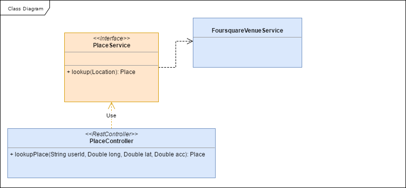

# Data Refresh System: Design Document

The system can receive locations (as a [latitude, longitude, accuracy] mobile GPS fix) that
represent a place that a user has visited and outputs information about that place. 

It uses Foursquare API to achieve its goal. In particular it uses the _search venue_ endpoint to retrieve
a list of venues within a certain radius determined by the input accuracy value.

Once a list of venues candidate is retrieved, the venue with the minimum distance from the user location is selected as 
_visited place_ and returned as output.

A visited place, once determined, is cached and subsequent queries, with same parameters, will be served from
the cache until the cache gets refreshed.

The following diagram shows the components involved:


The data refresh component exposes an endpoint that allows, for a given user, to retrieve a _visited place_.

The endpoint accepts GET requests with the following structure:

```
GET /user/{id}/place?ll=LAT,LONG@acc=ACC
```

and returns a Place json object (modelled as a [Venue](https://developer.foursquare.com/docs/responses/venue)) 
as response body with HTTP status 200 in case of successful match.
In case of error the service endpoint returns a HTTP 500 status and the message body contains a description
of the error message.

A Redis instance is used to cache a _visited place_ with a key having the following structure:
```
userid:lat:lang:acc
```
 
Redis default strategy (snapshots) is used to persist data on disk.  

Each key pointing to a _visited_place_ is associated with an TTL value of 30 days after which the key will
be evicted.


The Data refresh component is a Spring Boot application whose structure can be described by the following
class diagram:



The location endpoint is defined in the PlaceController which is a Spring Rest Controller.

The controller is concerned only with retrieving of the query string and creating the response body.

The controller delegates the actual retrieval logic to the `PlaceService` which accepts a `Location` value object 
containing the user id, the latitude, the longitude and the accuracy and returns a `Place` object to be serialized 
in the response body as a JSON string.

A `FoursquareVenueService` is provided as an implementation of the `PlaceService`

The `FoursquareVenueService` implements the logic to access the Foursquare API (via RestTemplate).

Spring cache is used to abstract the actual cache implementation. 
The `lookup` method is annotated with `@Cacheable` annotation. The name of the cache is `places`.
The `Location` object shall be used as cache key and therefore shall implement valid `equal` and `hashCode` methods.

[Redisson](https://github.com/redisson/redisson/wiki/14.-Integration%20with%20frameworks#142-spring-cache) is used as
 Spring Cache manager implementation. In the cache manager implementation a TTL of 30 days shall be defined.
 
 This will make sure that each cache entry is defined in Redis with the right TTL value. 