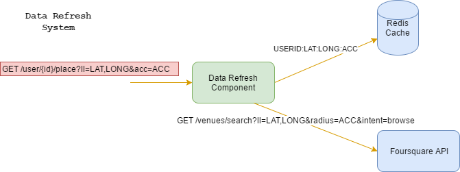

# Data Refresh System: Design Document

The system can receive locations (as a [latitude, longitude, accuracy] mobile GPS fix) that
represent a place that a user has visited and outputs information about that place. 

It uses Foursquare API to achieve its goal. In particular it uses the _search venue_ endpoint to retrieve
a list of venues within a certain radius determined by the input accuracy value.

Once a list of venues candidate is retrieved, the venue with the minimum distance from the user location is selected as 
_visited place_ and returned as output.

A visited place, once determined, is cached and subsequent queries, with same parameters, will be served from
the cache until the cache gets refreshed.

The following diagram shows the components involved:




The data refresh component exposes an endpoint that allows, for a given user, to retrieve a _visited place_.

The endpoint accepts GET requests with the following structure:

```
GET /user/{id}/location?ll=LAT,LONG@acc=ACC
```

and returns a [Venue](https://developer.foursquare.com/docs/responses/venue) response body with HTTP status 200
in case of successful match.
In case of error the service endpoint returns a HTTP 500 status and the message body contains a description
of the error message.

A Redis instance is used to cache a _visited place_ with a key having the following structure:
```
userid:lat:lang:acc
```
 
Redis default strategy (snapshots) is used to persist data on disk.  

Each key pointing to a _visited_place_ is associated with an TTL value of 1 month after which the key will
be evicted.


The Data refresh component is a Spring Boot application.
The location endpoint is defined in the LocationInfoController which is a Spring Rest Controller.

The controller is concerned only with retrieving the query string and creating the response body.

The controller delegates the actual retrieval logic to the LocationInfoService.

Location object and venue object

A FoursquareVenueService is provided as implementation of the LocationInfoService

The FoursquareVenueService implements the logic to access the foursquare API (via RestTemplate).

Spring cache is used to abstract the actual cache implementation. The lookup method is annotated
with 